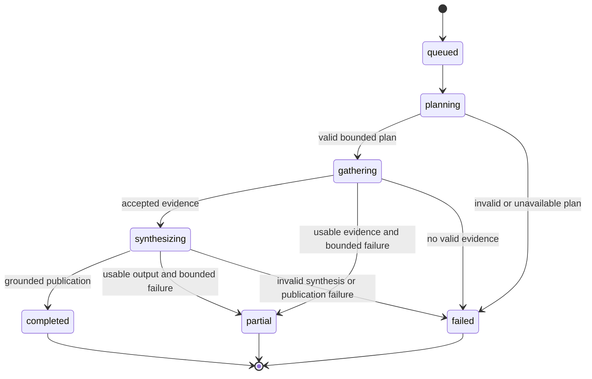

# Scout agent runtime

The Scout runtime turns an approved competitor scope into bounded, evidence-backed findings. It separates planning, research, validation, synthesis, and publication so untrusted model output never writes directly to the product record.

## Daily and manual Scout Runs

1. The API or scheduler creates a `ScoutRun` and durable job.
2. `ScoutOrchestrator` locks and starts the queued run, loads the competitor, approved URLs, recent findings, and prior context.
3. The main model returns a structured `ScoutPlan` whose task count, search calls, and first-party source scope are validated.
4. Child tasks execute in bounded waves. Each task has a role, kind, model, objective, scope, attempts, timestamps, usage, and safe failure data.
5. Evidence is normalized, checked against approved or permitted source scope, deduplicated, and persisted.
6. The main model synthesizes accepted evidence into a structured result.
7. `FindingPublicationService` revalidates grounding, confidence, citations, and deduplication before publishing findings.
8. The run ends as `completed`, `partial`, or `failed`, with usage and safe reasons recorded.

Re-entry into an intermediate run state indicates recovery after lease loss. The runtime terminalizes interrupted ownership rather than blindly duplicating work.

### Finding categories

The planner assigns each research task an expected category. Accepted evidence carries that value into synthesis as an `expected_category_hint`, but the synthesizer treats it as a hypothesis rather than evidence and overrides it when the quoted source supports a different category. The prompt owns the canonical definitions and ambiguity rules; the structured contract limits output to these categories:

- `pricing`: prices, plans, packaging, quotas, discounts, and plan entitlements.
- `product`: product launches, built-in capabilities and features, workflows, improvements, and removals.
- `positioning`: messaging, claimed differentiation, target customers, and stated market identity without a product change.
- `integration`: connections or technical relationships with a named third-party product or platform.
- `customer_win`: a named organization selecting, buying, adopting, or endorsing the competitor.
- `partnership`: a two-way commercial, channel, implementation, or technology relationship.
- `leadership`: executive or board appointments, departures, and promotions.
- `hiring`: open roles, hiring pushes, headcount expansion, and hiring slowdowns.
- `market_expansion`: entry into or withdrawal from a geography or market, including regional offices and localized availability.
- `other`: a material change that fits none of the categories above.

`product` includes the former `feature` category. Migration `0009_merge_feature_into_product` preserves historical findings by relabeling them before removing the legacy database enum value.

## Other run types

- **Source discovery** searches within configured limits, validates public URLs and registrable-domain scope, and creates suggestions without overriding prior approval decisions.
- **Weekly brief** is scheduled only when the completed user-local week contains at least one daily or manual Scout Run. It selects accepted findings from that period, asks the provider for a structured grounded summary, and persists finding references. Source discovery alone does not schedule a brief because it cannot publish findings. When qualifying Scout Runs produced no accepted findings, a canonical empty brief represents no material changes.

The brief title and executive summary are the only model-authored strings the interface shows verbatim, so the synthesis prompt constrains the title to state what changed rather than name the document type. The canonical empty title is a persisted value shared by `apps/backend/src/competitor_scout/schemas/briefs.py` and `apps/web/src/lib/schemas.ts`, and both reject a section-less brief that does not use it. Changing it requires updating both constants and migrating stored rows in the same change; migration `0008_rename_empty_brief_title` is the precedent.

## Trust and grounding

Prompts mark fetched content as untrusted and prohibit source instructions from changing the Scout objective. Structured provider output is necessary but not sufficient: application code validates plan limits, URLs, evidence scope, quoted material, normalized claims, confidence, citations, and publication ownership.

Approved first-party URLs define the core monitoring boundary. News evidence is subject to its own type and URL checks. Direct quoted evidence and source metadata remain attached to published findings for auditability.

## Budgets and concurrency

Every provider interaction is constrained by configured model selector, token, deadline, repair, retry, search-call, run-cost, user-daily-cost, and concurrency limits. Planning and synthesis deadlines apply to each provider attempt, so an allowed structured-output repair receives a fresh request deadline instead of inheriting the unused remainder of the previous attempt; repair counts and cost ceilings still bound the full phase. `OTARI_MAIN_MODEL` and `OTARI_CHILD_MODEL` both default to the Otari routing policy `general-mzai-then-openai-models`, so planning, research, synthesis, source discovery, and weekly briefs share its ordered provider fallback. Operators can still override either selector with a concrete model or another policy. Usage records distinguish known settled values from unavailable provider metadata; unknown values must not be silently treated as zero.

Budget enforcement is layered. Otari applies the workspace budget associated with `OTARI_AI_TOKEN` before an upstream model call; a hosted budget refusal is non-retryable, stops unstarted child-task waves, and is persisted as `otari_budget_exceeded` without exposing Otari's response detail. Competitor Scout's `MAX_RUN_COST_USD` and `MAX_USER_DAILY_COST_USD` remain independent application safety ceilings based on conservative preflight estimates and settled usage. The estimator receives the logical request role rather than inferring it from the selector because main and child calls can intentionally share one routing-policy name.

Source discovery always uses Otari's native `otari_web_search` because its job is to find candidate URLs across the competitor's public domain. FireCrawl begins only after source selection: a child task uses exactly one Otari tool per attempt, since the gateway refuses to combine `otari_web_search` with MCP servers in one request. `first_party_source_review` tasks fetch a fixed, approved set of URLs, so when `OTARI_FIRECRAWL_MCP_SERVER_ID` names a workspace-configured FireCrawl MCP server, `ScoutOrchestrator._child_tool_selection` routes those tasks through it instead of `otari_web_search`; `news_discovery` tasks always keep `otari_web_search` because they search rather than fetch known pages. Leaving the setting unset preserves the previous web-search-only behavior. Either way the same search/tool-call budget, evidence-scope validation, and untrusted-source policy apply. The declared tool name is threaded into the child prompt so the model cannot request a different or additional MCP capability. The FireCrawl variant requires an actual tool invocation before output and may list a URL in `sources_inspected` only after FireCrawl successfully returns content; a failed or empty fetch must become a limitation rather than a claim based on memory or snippets.

MCP-backed chat completions intentionally omit provider-side `response_format: json_schema`. The routed models can return a schema-valid answer without invoking an offered MCP function when strict structured output and MCP tools are combined. FireCrawl prompts therefore require raw JSON, and `OtariClient` removes at most one surrounding JSON/Markdown code fence before validating the result against the same strict Pydantic contract. Tool-free requests and requests using Otari's built-in `otari_web_search` retain strict provider-side JSON schema. Keeping that distinction is important: removing strict output from built-in web search creates long tool loops whose terminal response may not satisfy the application contract.

When a FireCrawl-tooled task exhausts `max_child_retries` (or hits a non-retryable error, such as a misconfigured server) without succeeding, `_execute_child_within_deadline` grants exactly one bonus attempt on `otari_web_search` before failing the task. This is additive, not carved out of `max_child_retries`: FireCrawl keeps its full configured retry budget, and the fallback attempt is bounded by the same `max_search_calls`/tool-iteration cap as any other attempt, so neither the retry budget nor the per-task tool-call budget is doubled or reduced by the swap. The swap happens at most once per task; a task with no FireCrawl configured has nothing to fall back from and is unaffected.

A task's search budget and the gateway's loop bound are related but not the same number. `MAX_CHILD_SEARCH_CALLS` and `MAX_SOURCE_DISCOVERY_SEARCH_CALLS` cap the searches a task may make, and the task prompt carries that cap. `max_tool_iterations` bounds every turn of Otari's model/tool loop, so a wasted search, an intermediate reasoning turn, and the turn that emits the structured result each spend one. Exceeding it is rejected as `otari_tool_iteration_limit`, which discards the whole call rather than returning partial work, so `tool_iteration_budget` in `agents/orchestrator.py` sizes the loop at the search budget plus `TOOL_ITERATION_HEADROOM`, clamped to the gateway's ceiling of 25. The headroom must stay above zero: sizing the loop at exactly the search budget plus one makes any imperfect model turn fail the task. Because Otari reports no tool-call count, the prompt and this loop bound are the only enforcement of the search budget.

Settled cost has two sources. Otari attaches `cost_usd` and `pricing_source` to a completion only when its platform settles inside the gateway's inline budget. When the completion carries no cost, `OtariClient` looks the amount up from Otari's durable `GET /api/v1/request-costs/{request_id}` endpoint, using the `X-Otari-Request-ID` header of the completion and retrying the `202` pending answer within `OTARI_COST_LOOKUP_ATTEMPTS` and `OTARI_COST_LOOKUP_DELAY_SECONDS`. A settlement counts only when it reports usage and names a pricing source, so an unpriced model stays unknown instead of reading as a free call, and a failed or still-pending lookup leaves the cost unknown rather than blocking the run. Otari reports no tool-call count on either path, so that metric is not part of usage reporting.

The `ScoutOrchestrator` owns an in-process semaphore shared by handlers in one worker process. Production therefore runs exactly one worker replica. Horizontal scaling requires a database-backed or external global permit before changing this invariant.

Cost or child-task failures can produce `partial` only when usable validated evidence or output remains. No valid evidence is a failure, not an empty successful run.

## Changing the runtime

When changing prompts, contracts, orchestration, or publication:

1. Update structured contracts and prompts together.
2. Preserve explicit scope, trust, and cost validation outside the model.
3. Add unit tests for limit, repair, retry, state, usage, and failure behavior.
4. Update recorded contract fixtures if the provider protocol intentionally changes.
5. Extend deterministic evals for signal quality, grounding, or prompt injection.
6. Keep normal verification offline. Run the hosted evaluation only with explicit approval, `ALLOW_PAID_OTARI_EVALS=true`, and `--confirm-paid-run`.
