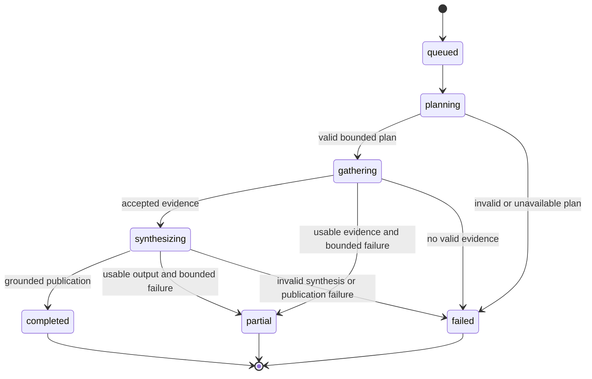

# Scout agent runtime

The Scout runtime turns an approved competitor scope into bounded, evidence-backed findings. It separates planning, research, validation, synthesis, and publication so untrusted model output never writes directly to the product record.

## Daily and manual Scout Runs

1. The API or scheduler creates a `ScoutRun` and durable job.
2. `ScoutOrchestrator` locks and starts the queued run, loads the competitor, approved URLs, recent findings, and prior context.
3. The main model returns a structured `ScoutPlan` whose task count, search calls, and first-party source scope are validated.
4. Child tasks execute in bounded waves. Each task has a role, kind, model, objective, scope, attempts, timestamps, usage, and safe failure data.
5. Evidence is normalized, checked against approved or permitted source scope, deduplicated, and persisted.
6. The main model synthesizes accepted evidence into a structured result.
7. `FindingPublicationService` revalidates grounding, confidence, citations, and deduplication before publishing findings.
8. The run ends as `completed`, `partial`, or `failed`, with usage and safe reasons recorded.

Re-entry into an intermediate run state indicates recovery after lease loss. The runtime terminalizes interrupted ownership rather than blindly duplicating work.

## Other run types

- **Source discovery** searches within configured limits, validates public URLs and registrable-domain scope, and creates suggestions without overriding prior approval decisions.
- **Weekly brief** selects accepted findings for a user-local weekly period, asks the provider for a structured grounded summary, and persists finding references. A canonical empty brief represents no material changes.

## Trust and grounding

Prompts mark fetched content as untrusted and prohibit source instructions from changing the Scout objective. Structured provider output is necessary but not sufficient: application code validates plan limits, URLs, evidence scope, quoted material, normalized claims, confidence, citations, and publication ownership.

Approved first-party URLs define the core monitoring boundary. News evidence is subject to its own type and URL checks. Direct quoted evidence and source metadata remain attached to published findings for auditability.

## Budgets and concurrency

Every provider interaction is constrained by configured model, token, deadline, repair, retry, search-call, run-cost, user-daily-cost, and concurrency limits. Usage records distinguish known settled values from unavailable provider metadata; unknown values must not be silently treated as zero.

The `ScoutOrchestrator` owns an in-process semaphore shared by handlers in one worker process. Production therefore runs exactly one worker replica. Horizontal scaling requires a database-backed or external global permit before changing this invariant.

Cost or child-task failures can produce `partial` only when usable validated evidence or output remains. No valid evidence is a failure, not an empty successful run.

## Changing the runtime

When changing prompts, contracts, orchestration, or publication:

1. Update structured contracts and prompts together.
2. Preserve explicit scope, trust, and cost validation outside the model.
3. Add unit tests for limit, repair, retry, state, usage, and failure behavior.
4. Update recorded contract fixtures if the provider protocol intentionally changes.
5. Extend deterministic evals for signal quality, grounding, or prompt injection.
6. Keep normal verification offline. Run the hosted evaluation only with explicit approval, `ALLOW_PAID_OTARI_EVALS=true`, and `--confirm-paid-run`.
