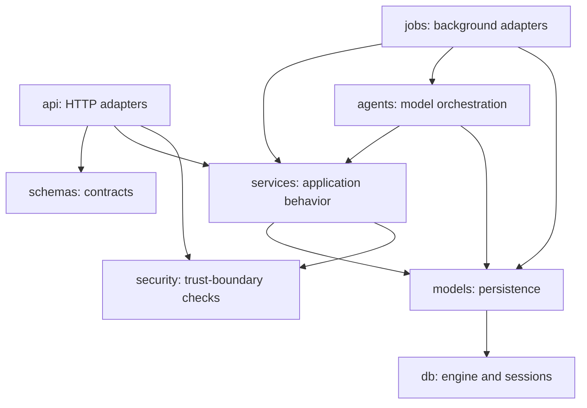

# Backend architecture

The backend is an async Python 3.12 application built with FastAPI, Pydantic, SQLAlchemy, Alembic, and PostgreSQL. The API and worker are separate processes that share models and service code.

## Dependency direction

This is a pragmatic layering rule, not a demand for artificial interfaces. Add a protocol where a provider, clock, validator, repository, or publisher needs substitution in tests. Avoid moving HTTP exceptions into domain logic or allowing route functions to accumulate reusable queries.

## API lifecycle

`main.create_app` assembles routers and injectable application state. Production constructs the database engine and OAuth provider; tests can supply session factories, readiness probes, current-user overrides, and URL validators only through explicit testing gates.

`api/deps.py` defines the common dependencies:

- `DbSession` opens one async session per request.
- `CurrentSession` resolves the opaque session cookie.
- `CurrentUser` exposes the authenticated user.
- `CsrfRequired` verifies the `X-CSRF-Token` header for mutations.

`session_dependency` owns the request transaction. It commits after a successful route and rolls back when an exception escapes. Services called by routes should flush when they need generated values but should not commit independently.

## Ownership and security

User isolation is an application invariant. Queries for competitors, sources, runs, tasks, findings, evidence, briefs, settings, and usage must include the authenticated user's ownership boundary. Nested lookups must not trust the parent ID alone.

External URL handling is another trust boundary. `security/urls.py` parses and normalizes destinations, resolves DNS, rejects credentials and non-HTTPS schemes, and accepts only public network addresses. Use this path for submitted or discovered sources instead of performing ad hoc URL checks.

Authentication and CSRF secrets are validated settings. `E2E_AUTH_SECRET` is rejected outside the test environment. Logging processors redact sensitive keys, and safe read models strip sensitive task content before it reaches the API.

## Contracts and errors

Pydantic schemas are the backend's public API contract. Routes declare response models, and the web application independently validates responses with Zod. A contract change is cross-stack unless the endpoint is backend-only.

`GET /api/v1/briefs/overview` is the user-scoped Weekly Digest readiness contract. It classifies setup required, setup incomplete, an initial scan in progress, the wait for a first scheduled digest, and an available archive. It returns the next Monday 08:00 user-local generation time only when active monitoring can produce one, plus active competitor and approved-source counts, relevant setup or run links, available Starting Snapshots, safe monitoring-issue counts, and the latest digest. Published brief reads include a nullable immutable monitoring-coverage receipt; `NULL` means historical coverage was not recorded. Keep these Pydantic and Zod shapes synchronized.

Exception handlers convert HTTP, validation, and unexpected failures into `application/problem+json` with `type`, `title`, `status`, `detail`, and `request_id`. Keep details useful but non-sensitive. Avoid revealing that another user's resource exists.

## Persistence and migrations

SQLAlchemy models are grouped by domain under `models/`; Alembic owns all schema history. Enums stored in PostgreSQL use the string values defined by the application enums. Review autogenerated migrations and test them against PostgreSQL. Follow `apps/backend/migrations/README.md` for naming and downgrade policy.

API changes that enqueue work should write domain state and the job row within one transaction. Background handlers should open explicit transaction scopes through the shared session factory.

## Durable jobs

The worker runs a scheduler loop and a bounded set of executors. A job repository atomically claims available rows using a lease owner and expiry, renews active leases, and records completion or a safe failure code. Stable deduplication keys prevent repeated scheduler passes or requests from creating duplicate logical work.

Handlers must expect retries and process interruption. Payloads should contain identifiers, not copied domain state. Reload and lock authoritative records before state transitions, and make terminal states safe to revisit.

## Testing strategy

| Suite               | Purpose                                                                                 |
| ------------------- | --------------------------------------------------------------------------------------- |
| `tests/unit`        | Pure validation, state transitions, services with substitutes, security helpers         |
| `tests/integration` | PostgreSQL behavior, transactions, API contracts, authentication, isolation, job leases |
| `tests/contract`    | Recorded provider protocol compatibility                                                |
| `tests/evals`       | Deterministic prompt, grounding, and injection-resistance gates                         |

The standard suite is offline. Live hosted evaluation is a separate, explicitly approved paid operation.
