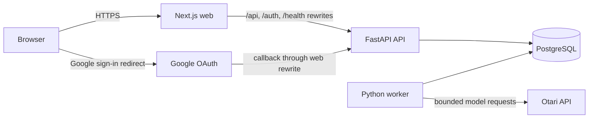

# Architecture overview

Competitor Scout is a small service-oriented monorepo: a public Next.js application fronts a private FastAPI API, while a separate Python worker schedules and executes durable jobs against the same PostgreSQL database.

## Runtime topology

In Railway these are `web`, `api`, `worker`, and `postgres` services. Only `web` is public. See `docs/railway-deployment.md` for deployment and recovery procedures.

## Synchronous request flow

1. The browser calls same-origin `/api/*` or `/auth/*` paths.
2. Next.js rewrites the request to the private FastAPI service.
3. FastAPI resolves the authenticated session, opens an async SQLAlchemy session, and enforces CSRF on mutations.
4. A thin route calls a user-scoped service operation.
5. The request dependency commits on success or rolls back on failure.
6. Responses are validated by Pydantic on the backend and Zod in the web client.

Errors use `application/problem+json` with a safe detail and request ID. Authentication uses an HTTP-only session cookie; mutating browser requests also send a session-bound CSRF token.

## Background flow

API operations and the scheduler create durable rows in the PostgreSQL job table. Worker executors claim jobs with expiring leases, renew the lease while a handler runs, and mark the job complete or failed. The main job types are source discovery, daily/manual Scout Runs, and weekly briefs.

After a competitor's daily time passes, the scheduler treats a completed or partial manual Scout Run from the same user-local calendar day as satisfying that day's cadence. A failed manual run does not suppress the scheduled daily run.

The database is both the source of truth and the coordination point. Job payloads carry identifiers; handlers reload current state before acting.

## Trust boundaries

- Browser input is untrusted and passes Pydantic/domain validation.
- Authenticated records are always scoped to the current user.
- Submitted and model-discovered URLs must resolve to public HTTPS destinations.
- Web content and model output are untrusted until contract and evidence validation succeeds.
- Provider credentials, cookies, prompts, and full model responses are excluded from API output and logs.
- Cost and concurrency ceilings are correctness controls, not merely operational tuning.

## Source map

| Concern                       | Primary location                                    |
| ----------------------------- | --------------------------------------------------- |
| API assembly and dependencies | `apps/backend/src/competitor_scout/main.py`, `api/` |
| Domain/application behavior   | `apps/backend/src/competitor_scout/services/`       |
| Persistence and migrations    | `models/`, `migrations/`                            |
| Durable jobs and worker       | `jobs/`, `worker_main.py`                           |
| Scout execution               | `agents/`                                           |
| Web routes and views          | `apps/web/src/app/`, `components/pages/`            |
| Runtime API validation        | `apps/web/src/lib/api.ts`, `schemas.ts`             |

Read `backend.md` for backend boundaries and `agent-runtime.md` for the Scout execution lifecycle.
